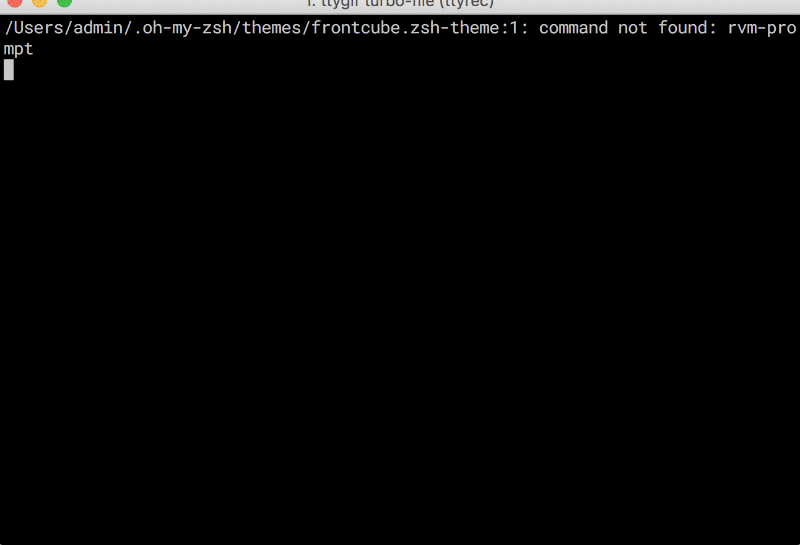
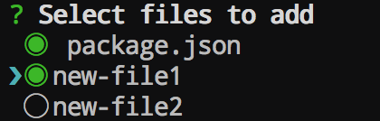
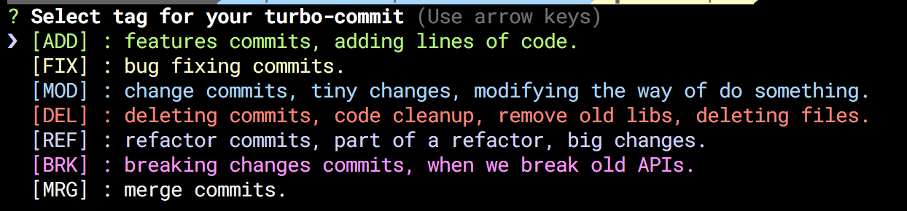
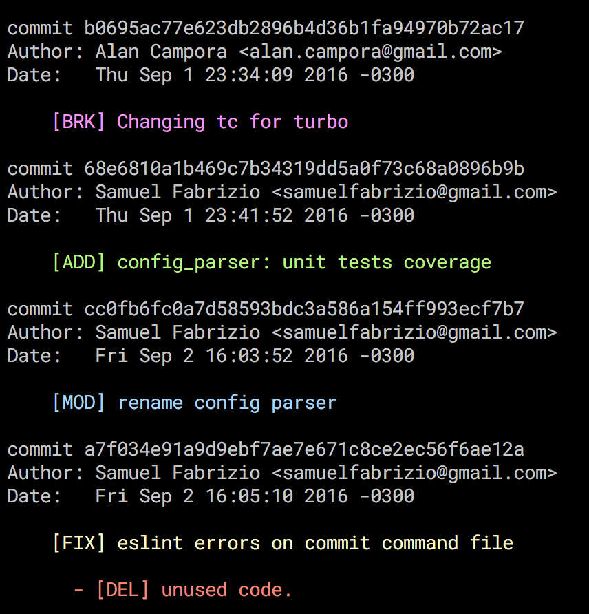

[](https://travis-ci.org/labs-js/turbo-git)
[](https://codeclimate.com/github/labs-js/turbo-git)
[](https://github.com/labs-js/turbo-git/blob/master/CONVENTION.md)
[](https://www.npmjs.com/package/turbo-git)
[](https://www.bithound.io/github/labs-js/turbo-git) [](https://codecov.io/gh/labs-js/turbo-git)

[](https://gitter.im/turbo-commit/Lobby)


# Turbo Git

This CLI tool was originally thought for implementing the [Turbo Commit Convention](/CONVENTION.md) easily. Now It's more than that.. You can use it with any other commit convention just choosing one with an utility command. And it's also good for tuning out of the box git commands.

If you enjoy the good quality software and you work hard for have it, You'll enjoy using a commit convention on your projects that ensures readability and understanding. You can also make some greats improvements on how you use git in the command line everyday.
Wouldn't it be great to have a tool that ensure all of this for you and for your team?

## Install

    npm install -g turbo-git

Hurrah! Now you're able to use the turbo commands! 🎉🙌✨

## Demo (outdate)



## Available Commands 

 Turbo command    | Git Alias       | Desciption    |
| -------------   | -------------   | ------------- | 
| `turbo init`    | `git ti`        | Init command, set a commit convention for a git repository.  |
| `turbo commit`  | `git tc`        | Execute a turbo commit using a convention.   |
| `turbo log`     | `git tl`        | Show the turbo log, git log with colors according your convention  |
| `turbo add`     | `git ta`        | Turbo add, utility for execute a git add is a easier way.   |

> Note: The turbo command will work also from git: `git turbo <command>`


## How to use

This is an example using the [Turbo Commit Convention](https://github.com/labs-js/turbo-git/blob/master/CONVENTION.md).

> First, add something to commit you can use `turbo add` or our `git ta` as well. You will be prompted with the following:



Select what you want to add by moving with the arrow key and pressing space.. then enter.

> Now you are able to do a *Turbo Commit* with the command `git tc` as follows:

    git tc

After that, you'll see the possible tags for your turbo-commits:



>Choose the tag to wrap your commit message, press enter.
>Now insert your commit title and the optional description and you're done.

Congrats! You did your first **Turbo Commit**. 😎

Now, you can see it in your **Turbo Log**. Executing `git tl` you will se the git log with the corresponding commit color.



Now you have a semantic git log 😎🙌


## Commit Conventions

If you want **Turbo Git** allows you work with any other commit convention. We provide some of them with the `turbo init` command and you can create one by your own in an easy way. You are able also to use different conventions per git repository that's what the  **.turbogit** file exactly does. You can create the **.turbogit** as follow:
```
git turbo init
```
or just
```
git ti
```
You will see the following options:

- Turbo Commit
- Angular
- Open UI5
- Custom

You can choose whatever you want.. and this init command will create a **.turbogit** file on your repo.
The **.turbogit** file.. It's just a json that you can easilly edit to your needs. 

> The Custom option is not doing to much at the moment. It's just creating the **.turbogit** file with some explanations about how to edit it.


## Coming soon

- Turbo changelog command, for autogenerate changelogs based on any commit convention.

- Improvements in the existing turbo commands adding functionalitty and a beter UX.

- We'll continue working on add new **turbo-commands** that will have some extra magic, any idea/help is welcome.

## Convention Badge

If you choose use the [Turbo Commit Convention](https://github.com/labs-js/turbo-commit/blob/master/README.md) Be proud like we are.. add the Badge to your projects 😁

<a href="https://github.com/labs-js/turbo-commit/blob/master/README.md"></a>

Markdown

    [](https://github.com/labs-js/turbo-git/blob/master/README.md)

Html

    <a href="https://github.com/labs-js/turbo-git/blob/master/README.md"></a>
