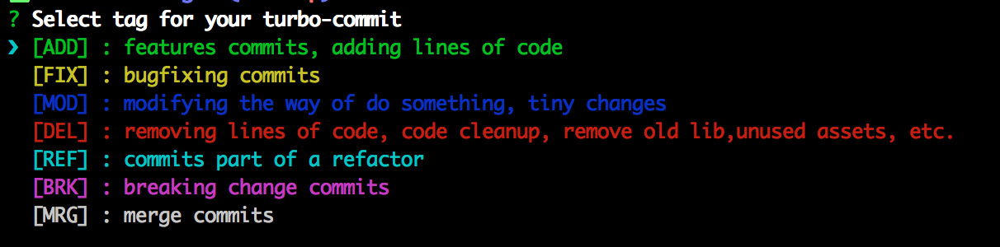

# Turbo Commit CLI 

CLI tool for the implement [turbo-commit](/CONVENTION.md) convention easilly

## Install 

    npm install -g turbo-commit

then we are able to use the `tc` command

## How to use

> First use `git add` like you ussualy do.. then commit with the `tc` command as follow:

    tc "my commit message"

Then you will be pront with the posibble tags for your turbo-commits:

